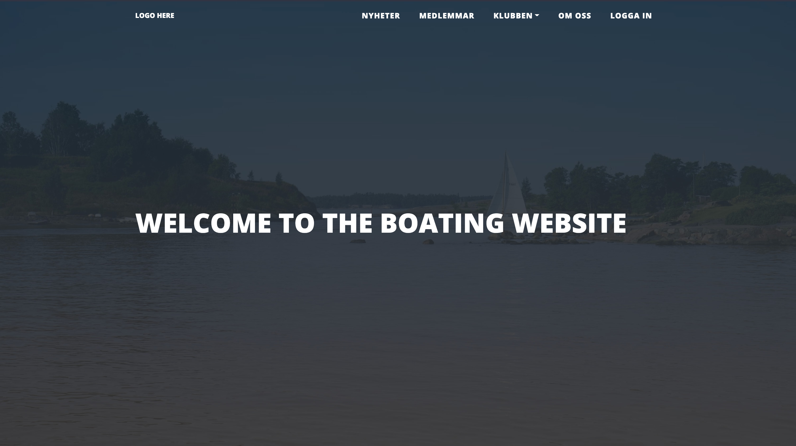

# Boating membership web app

A boating membership website using ReactJS for frontend, which is talking to a content delivery platform Directus via REST API's, MYSQL for persistence and Bootstrap for layout.
  

  

# Get started

Clone project and optionally change all the default and temporary environment variables for names and passwords in the docker-compose.yml files.  

Then run <code>docker-compose up</code>. This will run a react dev server which refreshes on save.  

If you want to start with some content structure for pages, news and menu go into the utils folder and run <code>database-restore.sh</code> This will restore the file <code>site.sql</code> in the <b>directus folder</b>

In case you are using content from site.sql you can log in to the membership pages with the temporary credentials below:

- Username: temp@temp.com
- Password: temp123

To log in to Direcus admin gui use the following temporary credentials:

- Username: admin@admin.com
- Password: admin123
    

# Built using

JavaScript (ES6), React Hooks, React Context API, SCSS, Bootstrap (based on https://startbootstrap.com/theme/clean-blog),

Created with <code>Create-React-App</code>
  

# Backup and restore tools

In the utils folders you can find script to dump and restore the db from the mysql docker container.   

Run <code>database-dump.sh</code> to create a backup of the current directus db.  
Run <code>database-restore.sh</code> to restore site.sql from /directus directory.
  

# Features

The solution dynamically supports the following:

- Login to access protected member pages
- News archive with infinite scroll
- Dynamic menu
- Fileuploads (images and other files)  

# Links

- https://directus.io/  
- https://github.com/directus/directus
